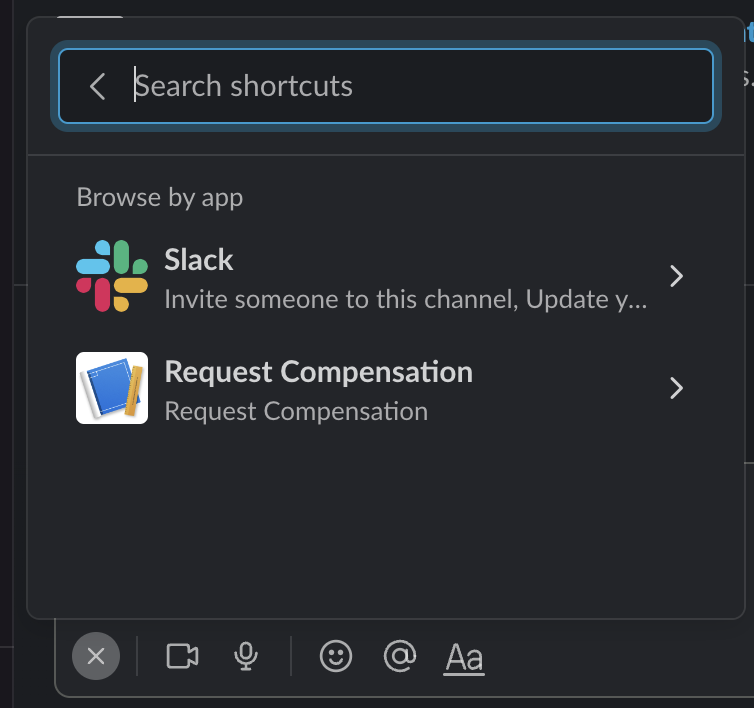

# Salesforce PDF Generator

This project helps you generate a PDF from a Custom Compensation Object in Salesforce using Slack, Salesforce and Salesforce Functions.

## Current Limitation

1. Do not use this if you are building the Slack app for AppExchange/Slack App Directory

2. Multiple salesforce org connections to a single Slack workspace are not supported.

## About the Project

This project helps you to create a Slack App that integrates Salesforce data using [Bolt SDK](https://api.slack.com/tools/bolt) (Node.js version) and [jsforce](https://jsforce.github.io/).

The app follows the monorepo approach. It contains a Slack App implemented using Bolt SDK (Node.js) and it also sets up the needed Salesforce data and metadata for managing users, authentication and compensation records. The scaffold provides configuration files to host and run the app on Heroku.

Most of Salesforce and Heroku setup tasks are automated to cut down a number of manual configurations required to set up development environments.

We also configure environment variables required for local development, debugging, and testing.

### Architecture Overview


This README file focuses on the installation of the apps, for more detailed information on the app architecture refer to [this README](./docs/README.md)

### Compensation Custom Object

We create a custom object called Compensation\_\_c which is related to the user:
```
Compensation__c
├── Name__c
├── Base_Salary__c
├── Bonus__c
├── OTE__c
└── User__c
```
In order to generate a PDF, a record has to be created in this object for the currently logged in user.

## Prerequisites

To be able to run this project you will need:

- `git` (download [here](https://git-scm.com/downloads))
- `node` 16.9 or higher (download [here](https://nodejs.org/en/download/))
- Salesforce Org
  - If you don't have one, [sign up](https://developer.salesforce.com/signup) for a free Developer Edition org.
  - If you want to use scratch orgs follow the [instructions](https://help.salesforce.com/articleView?id=sfdx_setup_enable_devhub.htm&type=5) to enable Dev Hub in your Salesforce Developer Org.
- `sfdx` CLI version sfdx-cli/7.129.0 or higher(download [here](https://developer.salesforce.com/tools/sfdxcli))
- Heroku account ([signup](https://signup.heroku.com))
- `heroku` CLI (download [here](https://devcenter.heroku.com/articles/heroku-cli))

## Setup Steps

### Configuring Slack app at api.slack.com

1. Open [https://api.slack.com/apps/new](https://api.slack.com/apps/new) and choose _From an app manifest_
2. Choose the workspace you want to install the application to
3. Copy the contents of [manifest.yml](./apps/salesforce-pdf-generator/manifest.YAML) and replace the code, then click _Next_
4. Review the configuration and click _Create_
5. Now click _Install App_ in the left menu. Then click the _Install to Workspace_ button and then click on _Allow_

### Deploying the app using a Salesforce Non-scratch org and Heroku

1. Clone the salesforce-pdf-generator repository

Note: change the link when forking
```
git clone https://github.com/michaelhiebert/salesforce-pdf-generator
```

2. Authenticate to your Salesforce org and set as default:

```
sfdx auth:web:login --setdefaultusername -a mydevorg
```

3. Login to your Heroku Account

```
heroku login
```

4. Login to Salesforce Functions

```
sf login functions
```

5. Run the Deployment Script

```
cd salesforce-pdf-generator/scripts
npm install
cd ..
node scripts/deploy.js
```

6. Choose **Non-Scratch Org** when the script prompts you to select a Salesforce environment

7. The script prompts you to enter a value for the `SLACK_BOT_TOKEN`. To enter this value, open your app's configuration page from [this list](https://api.slack.com/apps), click _OAuth & Permissions_ in the left hand menu, then copy the value in _Bot User OAuth Token_ and paste it into the terminal.

8. The script prompts you to enter the `SLACK_SIGNING_SECRET`. To enter this value open your app's configuration page from [this list](https://api.slack.com/apps), click _Basic Information_ and scroll to the section _App Credentials_ and click the _show_ button and copy the _Signing Secret_ and paste it into the terminal.

### Deploying the app using a Salesforce scratch org and Heroku

1. Clone the salesforce-pdf-generator repository

Note: change the link when forking
```
git clone https://github.com/michaelhiebert/salesforce-pdf-generator
```

2. Authenticate to your Salesforce org that has DevHub enabled

```
sfdx auth:web:login --setdefaultdevhubusername -a DevHub
```

3. Login to your Heroku Account

```
heroku login
```

4. Login to Salesforce Functions

```
sf login functions
```

5. Run the Deployment Script

```
cd salesforce-pdf-generator/scripts
npm install
cd ..
node scripts/deploy.js
```

6. Choose **Scratch Org** when the script prompts you to select a Salesforce environment

7. The script prompts you to enter a value for the `SLACK_BOT_TOKEN`. To enter this value, open your app's configuration page from [this list](https://api.slack.com/apps), click _OAuth & Permissions_ in the left hand menu, then copy the value in _Bot User OAuth Token_ and paste it into the terminal.

8. The script prompts you to enter the `SLACK_SIGNING_SECRET`. To enter this value open your app's configuration page from [this list](https://api.slack.com/apps), click _Basic Information_ and scroll to the section _App Credentials_ and click the _show_ button and copy the _Signing Secret_ and paste it into the terminal.

### Configuring Heroku Domain URL in Slack app Manifest

1. To configure Heroku domain open your apps configuration page from [this list](https://api.slack.com/apps), click _App Manifest_.

2. Find the `request_url` fields in the manifest and modify it to replace `heroku-app` with your actual heroku domain name.

   **At the end of this step your `request_url` should look like `https://<heroku-domain>.herokuapp.com/slack/events`**

## Deployment Script Actions

The [`scripts/deploy.js`](./scripts/deploy.js) automates the deployment of the Slack app built using Bolt SDK (Node.js version) and the Salesforce App.

The high-level overview of actions performed by the deployment script is listed below.

1. **Salesforce Org Setup**

The script prompts you to Select the Salesforce Development Environment type. The script creates a scratch org using the provided dev hub if you choose a scratch org-based development. The script then deploys the source code and the associated metadata and assigns the necessary permission set to the user.

2. **Generation of certificate needed for JWT Bearer flow OAuth flow**

We generate a private key and digital certificate to set up the JWT Bearer flow for authentication.

3. **Salesforce ConnectedApp deployment**

Both the JWT Bearer and the Web Server flows need a connected app to be deployed to Salesforce. We use the same connected app for both flows. In the case of JWT bearer flow, a consumer key, and a digital certificate is needed. In the case of Web Server flow, a consumer key, consumer secret, and a callback URL are needed. All these configuration values are autogenerated and set up in the connected app that we deploy to Salesforce.

4. **Heroku Bolt Node.js app creation and deployment**

We create a Heroku app, set up all the needed configuration variables and deploy the Bolt Node.js app.

We also write the configuration variables to a .env file for local development

5. **Salesforce Function app deployment**

Finally, we deploy the Salesforce Function

## How to Build and Deploy Code

### Building the Salesforce app using a Scratch Org

- For Salesforce metadata synchronization in scratch orgs use `sfdx force:source:pull` to retrieve and `sfdx force:source:push` to deploy metadata from orgs to local project folder `force-app`

### Building the Salesforce App Using Non-Scratch Org

- For Salesforce metadata synchronization in developer orgs use `sfdx force:source:retrieve -p force-app/main/default` to retrieve and `sfdx force:source:deploy -p force-app/main/default` to deploy metadata from orgs to local project folder `force-app`

### Building and deploying the Bolt Node.js app

- For the Bolt Node.js app use the steps below:
  - cd into apps/slack-salesforce-starter-ap folder `cd apps/salesforce-pdf-generator`
  - add git remote to app repo using `heroku git:remote -a <heroku app name>`
  - run `git push heroku main` to push code to Heroku

## Local Development

1. To use ngrok, first install it by downloading the executable, or with npm:

```console
$ npm install ngrok -g
```

2. Next you’ll have to [sign up](https://dashboard.ngrok.com/get-started/setup) for a free ngrok account.
3. Once logged in, navigate to “Setup & Installation“ and copy your auth token.
4. Then set your auth token in your local machine:

```console
$ ngrok authtoken my_auth_token
```

5. Run the ngrok tunnel as follows:

```console
$ ngrok http 3000
```

6. Copy the ngrok tunnel URL to the following places:

- Your manifest file request URLs
- The HEROKU_URL environment variable in your .env file
- The Callback URL for the connected app that’s used for authorization in Salesforce - simply add the ngrok URL in a new line

7. Now you are prepared to run the app locally! In another terminal different from the one in which you’re running ngrok, execute `node app.js` from the project folder. You can then make changes to the code and restart the app as many times as you want.

## How to Test the Salesforce Connection

1. Authenticate to Salesforce by navigating to Home in the app and clicking the `Authorize with Salesforce` button.

You will need the password of your scratch org. You can generate one using `sfdx force:user:password:generate --targetusername scratchorg`


2. Once successfully authorized, run the Global Shortcut command `Request compensation` that ships with the app as shown in the below screenshot



3. Confirm the PDF request in order to generate the PDF


4. Successful PDF Generation request output is similar to screenshot below


5. Once the PDF is generated, the App's bot will send a message with a link to download the PDF from Salesforce

Note: the command can fail the first time you execute it if you are using the Free Tier of heroku app as dynos will go into sleep mode if left idle. Restart the app to resume.

## Considerations for Production app

- For a production application, change the `SF_LOGIN_URL` from 'https://test.salesforce.com' to `https://login.salesforce.com`

- Generate the private key and certificates using open SSL as documented in the Salesforce (docs)[https://developer.salesforce.com/docs/atlas.en-us.sfdx_dev.meta/sfdx_dev/sfdx_dev_auth_key_and_cert.htm] and change environment variables in Heroku to use new `private key`, `consumer key` and `client secret` obtained from the connected app in Salesforce.

- Heroku Free Dynos sleeps if left idle. For Production application we recommend you look into [other types](https://www.heroku.com/dynos) of Dynos.

## Troubleshooting

- Connected app's activation takes a couple minutes. In case the app fails with a 400 error for JWT auth, wait for 2 minutes and give a retry.
- If the app is failing, tail Heroku logs to see any errors

## Further Reference

- [Bolt Family of SDKs](https://api.slack.com/tools/bolt)
- [Block Builder](https://www.npmjs.com/package/slack-block-builder)
