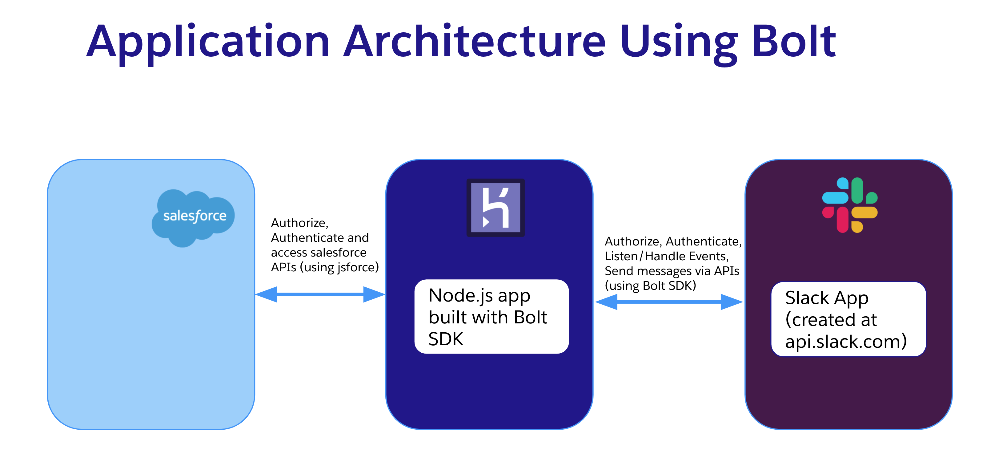
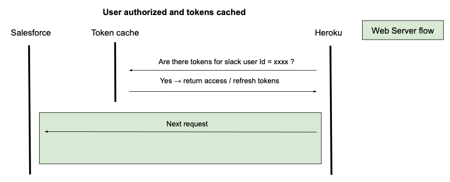
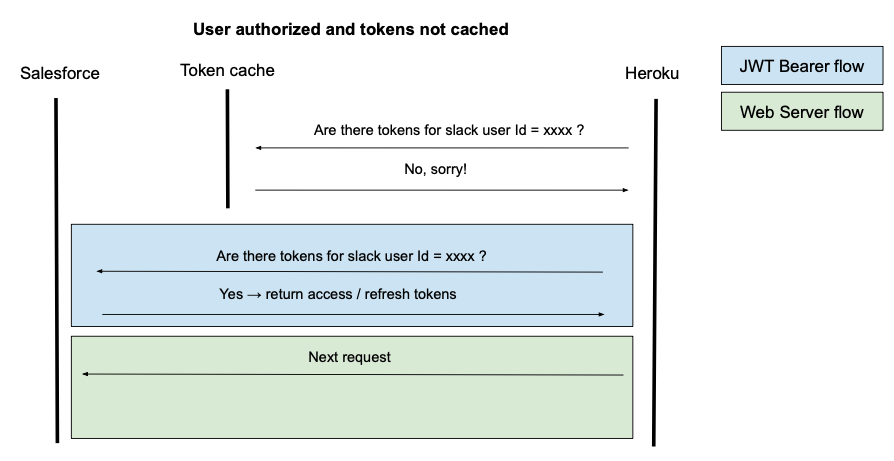
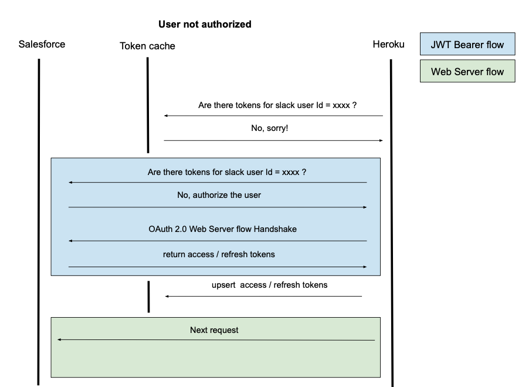

## App Architecture

### System Architecture

The image below shows the systems involved in the application.



Heroku acts as middleware and hosts the Node.js app that connects to Slack APIs (through Slack Bolt) and Salesforce APIs (through jsforce). To get familiar with the app's system architecture, you can watch this short [video](https://www.youtube.com/watch?v=x0i7UNuMTAM) and familiarize yourself with the app's system architecture.

We use Heroku environment variables to securely manage necessary configuration variables (such as clientId, consumer key and signing secret) related to Slack and Salesforce connection.

### Heroku App <-> Salesforce

The app uses jsforce and the [OAuth 2.0 Web Server Flow for Web App Integration
](https://help.salesforce.com/s/articleView?id=sf.remoteaccess_oauth_web_server_flow.htm&type=5) flow to connect to Salesforce.

Once the user successfully authorizes a Slack workspace to Salesforce, we persist the access and refresh tokens. This allows the app to perform subsequent requests to Salesforce as an authorized user.

We store the tokens securely in a Salesforce custom object called Slack_Authentication\_\_c:

```
Slack_Authentication__c
├── Access_Token__c
├── Refresh_Token__c
├── Slack_User_ID__c
├── User__c
```

On each request, the app needs to query this object to find if the user has already been authorized. Although in reality, it first tries to retrieve this info from a cache that we've implemented to improve performance. Since we don’t know if the user is authorized yet at this stage, we need to use the [OAuth 2.0 JWT Bearer Flow for Server-to-Server Integration](https://help.salesforce.com/s/articleView?id=sf.remoteaccess_oauth_jwt_flow.htm&type=5) flow to perform this first step.

Once authorized, the app uses the stored access and refresh tokens to perform requests to Salesforce in the context of the authorized user.

These are the three possible scenarios for the authorization process:








### Heroku App <-> Slack

The Heroku App connects to Slack using Bolt.js.

### Compensation Custom Object

We create a custom object called Compensation\_\_c which is related to the user:
```
Compensation__c
├── Name__c
├── Base_Salary__c
├── Bonus__c
├── OTE__c
└── User__c
```
In order to generate a PDF, a record has to be created in this object for the currently logged in user.

## Directory Structure

```bash
├── force-app                             # Folder that holds Salesforce metadata types
├── scripts
│   ├── deploy                            # Scripts to automate scratch org creation, heroku
│   │                                     # environment
│   ├── deploy.js                         # Automated Deploy script launch file
│   └── templates                         # Template for Connected apps setup
├── apps
     ├── salesforce-slack-app             # Node.js Slack app
        ├── config                        # Configs for Slack app
        ├── listeners                     # Modules to listen event for actions,
        │                                 # shortcuts and view events in Slack
        ├── middleware                    # Middleware for Salesforce
        │                                 # Authentication using OAuth 2.0 Web based flow
        ├── routes                        # Route for OAuth callback
        │
        ├── app.js                        # Main file for Slack app launch
        ├── user-interface                # User Interface folder for Home page
        │                                 # Modals and Messages in Block Kit format
        │
        ├── salesforce                    # Folder for Salesforce integration related code
            ├── server-server-auth.js     # Module to establish Salesforce connection
            │                             # using JWT
            ├── user-user-auth.js         # Module to establish Salesforce connection 
            │                             # using Web based OAuth 2.0
        ├── manifest.YAML                 # Slack app manifest file
        └── Procfile                      # Heroku Procfile for deployment
├── functions
     ├── pdfgenerator
        ├── assets
            ├── compensation_template.pdf # PDF form template
        └── index.js                      # Main file for the SF Function
```